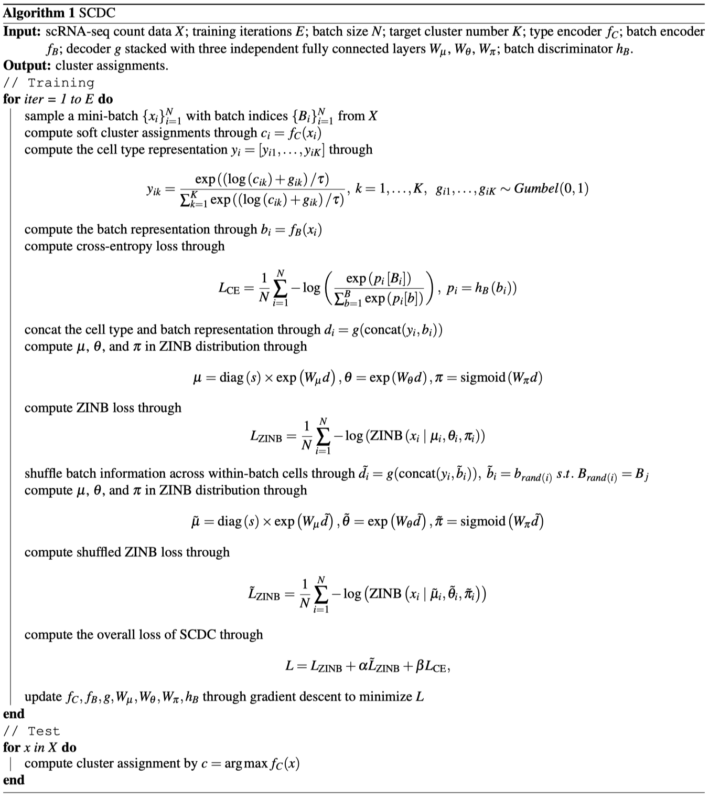

### Pseudocode for SCDC



### Dependency

Our SCDC algorithm is implemented in Python, with the following package dependencies.

- python=3.8.5
- pytorch=1.7.0
- numpy=1.19.4
- tqdm=4.52.0
- pandas=1.1.4
- scikit-learn=0.23.2
- munkres=1.1.4
- scipy=1.5.4
- scanpy=1.7.2

For building the Python environment, we recommend using the anaconda (https://www.anaconda.com/) to manage packages. After the installation, the conda environment could be built and activated by running

```
conda create -n SCDC python=3.8.5
conda activate SCDC
```

After creating a conda environment, the above packages could be installed by running

```
conda install (package-name)[=package-version]
```

Among these, scanpy (https://anaconda.org/bioconda/scanpy) is not included in anaconda's base channel and could be installed by running

```
conda install -c bioconda scanpy
```

We recommend installing Pytorch following the instructions in https://pytorch.org/ for different operating systems.

All our experiments are conducted on a Nvidia RTX 2080Ti Gpu on the Ubuntu 20.04 OS with CUDA 11.0. Generally, the code could be successfully runned as long as the conda enverionment stays consistent.

### Usage

To use SCDC for clustering, one could simply run the following command:

```
python main.py
```

In the dataset folder, we provide the Mouse Haematopoietic Stem and Progenitor Cells and Cell Line datasets as two examples. The count data is stored in the sparse matrix to save space. Running the above command clusters the former dataset by default. On our machine, the performance reported on the Mouse Haematopoietic Stem and Progenitor Cells in the manuscript could be reproduced with the expected output

```
NMI=0.5423, ACC=0.7156, ARI=0.6238, BER=60.9683, ARI_b=0.0897
```

One could also test SCDC on Cell Line by adding an argument:

```
python main.py --dataset='CellLine'
```

On our machine, the performance on the Cell Line reported in the manuscript could be reproduced with the expected output

```
NMI=0.9618, ACC=0.9959, ARI=0.9837, BER=0.0786, ARI_b=0.4146
```


Note: an argument could be added to test the performance of SCDC under different random seeds, namely,

```
python main.py --seed=(random_seed)
```
